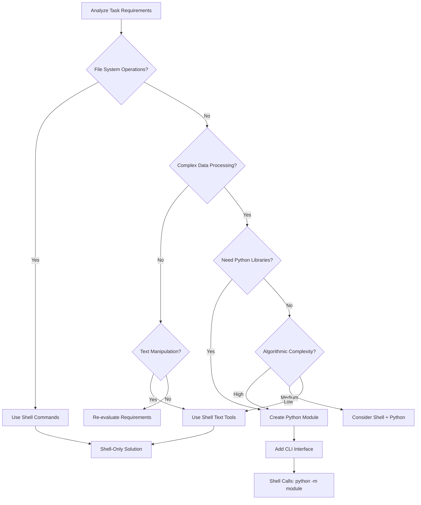

# Cross-Language Architecture Standards

## Scope
REQUIRED: Apply these standards to all multi-language development activities, especially Shell+Python mixed environments.
REQUIRED: Treat Python as the primary host for complex automation and Shell as a thin wrapper or OS-near glue layer.

## Absolute Prohibitions
PROHIBITED: Use inline Python code (`python -c` or here-doc) in shell scripts
PROHIBITED: Embed complex logic across language boundaries
PROHIBITED: Create circular dependencies between language components
PROHIBITED: Use Python for tasks that can be accomplished with shell builtins
PROHIBITED: Mix languages without clear separation of concerns
PROHIBITED: Implement hybrid designs where business rules are split across Shell and Python in ways that make behavior difficult to reason about

## Communication Protocol
REQUIRED: Use class-based architecture over standalone functions for complex logic
REQUIRED: Apply dependency injection for better testability and maintainability
REQUIRED: Implement proper separation of concerns between modules and components
REQUIRED: Focus on behavior testing over implementation testing
PROHIBITED: Use apologies or understanding confirmations in code or documentation

## Library-First Architecture

### Python as Library Module Pattern
REQUIRED: Structure Python code as importable modules with CLI entry points
REQUIRED: Use `python -m module.name` instead of `python -c` for all Python calls
PREFERRED: Create dedicated CLI interfaces for shell integration
REQUIRED: Design modules as libraries first, CLI interfaces second
PREFERRED: Declare Python automation entrypoints via uv-managed scripts in `pyproject.toml` where feasible

#### Anti-Inline Patterns

**PROHIBITED (Inline Python)**:
```bash
# NEVER do this
python3 -c "
import json
data = json.load(open('$file'))
print(data['key'])
"

# NEVER do this either
python3 <<'PY'
import yaml
with open('$file') as f:
    data = yaml.safe_load(f)
print(data.get('version', ''))
PY
```

**REQUIRED (Library Module Pattern)**:
```bash
# ALWAYS do this
python3 -m lib.python.json_extractor extract "$file" --field key

# For YAML processing
python3 -m lib.python.yaml_utils extract "$file" --field version --format json
```

### Shell-Python Integration Protocol

#### Standard CLI Interface Requirements
REQUIRED: Python modules provide standardized CLI interfaces:
- Positional arguments for required inputs
- `--format json|text` for output control
- `--quiet` for reduced output
- Proper exit codes (0=success, 1=error)
- Consistent error handling across modules
PREFERRED: Expose the same interfaces via uv-managed scripts to simplify invocation in both development and runtime environments

#### Error Handling Across Languages
REQUIRED: Python modules return structured error information
REQUIRED: Shell scripts check exit codes and handle appropriately
REQUIRED: Use JSON for complex data exchange between shell and Python
REQUIRED: Provide meaningful error messages with context

#### Data Exchange Standards
REQUIRED: Use structured formats for complex data:
- JSON for nested data structures
- TOML for configuration files
- Plain text for simple values

PREFERRED: Use null-separated streams for large datasets
PROHIBITED: Use ad-hoc delimited text for structured data

### Module Organization Standards

#### Directory Structure
```
project-or-plugin/
├── README.md
├── lib/
│   ├── common.sh                # Shell helpers (strict mode, orchestration)
│   ├── phases/ | other shell subdirs
│   └── python/
│       └── <package>/           # snake_case package exposing Python CLIs
│           ├── __init__.py
│           ├── path_resolver.py
│           ├── config_validator.py
│           └── ... domain modules ...
├── scripts/
└── adapters/ or additional glue layers
```

##### Package Boundary Requirements
REQUIRED: Keep Python modules under `lib/python/<package>` so shell helpers and Python libraries are colocated yet clearly separated; adjust `PYTHONPATH` only with the `lib/python` root before invoking `python -m <package>.<module>`.
REQUIRED: Use snake_case for `<package>` names; when the folder backs a slash command, mirror the command name (e.g., `/config-sync` → `config_sync`), but the same pattern applies to any taxonomy component exposing Python helpers.
PROHIBITED: Import packages directly from shell directories or scatter Python modules alongside `.sh` files—`lib/python/` is the only approved boundary for embedded Python.

#### Python Module CLI Pattern
```python
#!/usr/bin/env python3
"""CLI module for specific functionality."""

import argparse
import json
import sys
from typing import Dict, Any, Optional
from pathlib import Path

def process_file(file_path: Path) -> Dict[str, Any]:
    """Main processing logic - testable in isolation."""
    # Implementation here
    pass

def main() -> None:
    """CLI entry point with standardized interface."""
    parser = argparse.ArgumentParser(
        description='Process configuration files',
        formatter_class=argparse.RawDescriptionHelpFormatter,
        epilog="""
Examples:
  %(prog)s config.toml                    # Text output
  %(prog)s config.toml --format json      # JSON output
  %(prog)s config.toml --field version    # Extract specific field
        """
    )

    parser.add_argument('input_file',
                       help='Input file path')
    parser.add_argument('--format',
                       choices=['json', 'text'],
                       default='text',
                       help='Output format (default: text)')
    parser.add_argument('--field',
                       help='Extract specific field')
    parser.add_argument('--quiet',
                       action='store_true',
                       help='Reduce output verbosity')

    args = parser.parse_args()

    try:
        file_path = Path(args.input_file)
        if not file_path.exists():
            raise FileNotFoundError(f"File not found: {args.input_file}")

        result = process_file(file_path)

        if args.field:
            # Extract specific field
            if isinstance(result, dict) and args.field in result:
                output = result[args.field]
            else:
                raise KeyError(f"Field '{args.field}' not found")
        else:
            output = result

        # Format output
        if args.format == 'json':
            print(json.dumps({"success": True, "data": output}, indent=2))
        elif not args.quiet:
            if isinstance(output, (dict, list)):
                print(json.dumps(output, indent=2))
            else:
                print(output)

        sys.exit(0)

    except Exception as e:
        # Structured error output
        error_data = {
            "success": False,
            "error": str(e),
            "error_type": type(e).__name__
        }

        if args.format == 'json':
            print(json.dumps(error_data, indent=2))
        else:
            print(f"Error: {e}", file=sys.stderr)

        sys.exit(1)

if __name__ == "__main__":
    main()
```

## Language Selection Matrix

### Decision Tree for Cross-Language Tasks



### Use Case Categories

#### Shell-Only Tasks (No Python Integration)
- File and directory operations (mkdir, cp, rm, find)
- Process management and monitoring
- Simple text filtering and transformation
- Environment variable handling
- Permission and ownership management

#### Python-Only Tasks (No Shell Integration)
- Complex data structure manipulation
- API calls and HTTP requests
- Database operations
- Mathematical computations
- Business logic implementation
- Any automation where reuse, testing, or structured data validation is critical and Python is available

#### Hybrid Tasks (Shell + Python Integration)
- Configuration file processing (Shell finds files, Python parses content)
- Data transformation pipelines (Shell orchestrates, Python processes)
- Validation workflows (Shell manages I/O, Python implements logic)
- System integration (Shell handles environment, Python interfaces with services)
- Scenarios where environment-specific orchestration is required but core logic must remain in Python modules

## Testing Multi-Language Integration

### Cross-Language Testing Requirements
REQUIRED: Test shell→Python integration end-to-end
REQUIRED: Validate CLI interfaces with various argument combinations
REQUIRED: Test error handling across language boundaries
PREFERRED: Use subprocess in Python tests to simulate shell calls
REQUIRED: Test data exchange formats (JSON, TOML, plain text)

### Integration Test Patterns

#### Shell Tests for Python Modules
```bash
#!/usr/bin/env bash
# test_python_integration.sh

set -euo pipefail

test_module_cli() {
    local module="$1"
    local test_file="$2"
    local expected_exit_code="${3:-0}"

    echo "Testing $module CLI interface..."

    # Test with valid input
    if python3 -m "$module" "$test_file" --format json >/dev/null 2>&1; then
        echo "✓ $module handles valid input correctly"
    else
        echo "✗ $module failed on valid input"
        return 1
    fi

    # Test error handling
    if ! python3 -m "$module" "nonexistent.toml" >/dev/null 2>&1; then
        echo "✓ $module handles invalid input correctly"
    else
        echo "✗ $module should fail on invalid input"
        return 1
    fi
}

# Run integration tests
test_module_cli "lib.python.toml_validator" "test_data/valid.toml"
```

#### Python Tests for Shell Integration
```python
#!/usr/bin/env python3
# test_shell_integration.py

import subprocess
import json
import tempfile
from pathlib import Path
from typing import Dict, Any

def test_shell_calls_python_module():
    """Test that shell properly calls Python modules."""

    # Create temporary test file
    with tempfile.NamedTemporaryFile(mode='w', suffix='.toml', delete=False) as f:
        f.write('description = "test"\nprompt = "hello world"')
        f.flush()

        try:
            # Test shell script calls Python module
            result = subprocess.run([
                'bash', '-c',
                f'python3 -m lib.python.toml_validator "{f.name}" --format json'
            ], capture_output=True, text=True, timeout=10)

            # Verify successful execution
            assert result.returncode == 0, f"Module failed: {result.stderr}"

            # Parse JSON output
            output = json.loads(result.stdout)
            assert output.get('success') is True

        finally:
            Path(f.name).unlink()
```

## Performance Considerations

### Startup Overhead Management
PREFERRED: Batch operations to reduce Python process startup overhead
REQUIRED: Use long-running Python processes for repeated operations
PREFERRED: Implement caching in Python modules for expensive operations

### Memory Efficiency
REQUIRED: Use streaming for large datasets between shell and Python
PREFERRED: Process data in chunks rather than loading everything into memory
REQUIRED: Clean up resources properly in cross-language boundaries

## Migration Guidelines

### Converting Existing Inline Python

#### Step-by-Step Migration Process
1. **Identify**: Find all instances of `python -c` and here-doc Python
2. **Extract**: Move Python code to dedicated module files
3. **Standardize**: Add argparse CLI interface with standard options
4. **Replace**: Update shell calls to use `python -m module.name`
5. **Test**: Add comprehensive integration tests
6. **Document**: Update documentation and examples

#### Migration Example
```bash
# Before (Anti-Pattern)
result=$(python3 -c "
import yaml
import json
with open('$config_file') as f:
    data = yaml.safe_load(f)
version = data.get('metadata', {}).get('version', 'unknown')
print(version)
")

# After (Library Pattern)
result=$(python3 -m lib.python.yaml_utils extract "$config_file" --field metadata.version --quiet)
```

## Validation Rules

### Static Analysis
REQUIRED: Use ShellCheck to detect `python -c` usage and flag as errors
REQUIRED: Configure Python linters to ensure proper CLI interface implementation
PREFERRED: Use custom scripts to validate cross-language integration patterns

### Runtime Validation
REQUIRED: Validate that all Python modules can be called via `python -m`
REQUIRED: Test CLI interfaces with help and error conditions
REQUIRED: Verify proper exit codes and error handling
```
