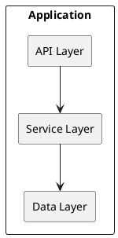

# Development Tools and Configuration

Comprehensive tool preferences and configurations for optimal development workflow.

## Tool Management

### Primary Tool Manager: mise
- Purpose: Language versions, environment variables, and PATH management
- Configuration: `.mise.toml` or `.tool-versions` files
- Benefits: Consistent tool versions across projects and team members

#### mise Configuration
```toml
# .mise.toml
[tools]
go = "1.23.0"
golangci-lint = "latest"
python = "3.13"
ruff = "latest"
node = "20.11.0"
docker = "latest"
plantuml = "latest"

[env]
GOLANGCI_LINT_CACHE = ".cache/golangci-lint"
UV_CACHE_DIR = ".cache/uv"
PYTHONPATH = "."
GOPATH = "~/.local/share/go"

[task.test]
description = "Run all tests"
run = "uv run pytest tests/ -v"

[task.lint]
description = "Run linting checks"
run = "uv run ruff check . && golangci-lint run"

[task.format]
description = "Format all code"
run = "uv run ruff format . && goimports -w ."
```

## Language-Specific Tooling

### Python Development Stack

#### Package Management: UV
```bash
# Installation
curl -LsSf https://astral.sh/uv/install.sh | sh

# Project setup
uv init myproject
cd myproject

# Development tools
uv tool install ruff
uv tool install pytest
uv tool install pytest-cov

# Usage patterns
uv run ruff check .          # Check code quality
uv run ruff format .         # Format code
uv run pytest tests/ -v      # Run tests
```

#### pyproject.toml Configuration
```toml
[project]
name = "myproject"
version = "0.1.0"
dependencies = [
    "fastapi>=0.100.0",
    "pydantic>=2.0.0",
    "sqlalchemy>=2.0.0",
]

[project.optional-dependencies]
dev = [
    "ruff>=0.1.0",
    "pytest>=7.0.0",
    "pytest-cov>=4.0.0",
    "pytest-mock>=3.11.0",
]

[tool.ruff]
line-length = 88
select = ["E", "W", "F", "I", "S", "C", "B", "UP"]
target-version = "py313"

[tool.ruff.lint]
select = ["ALL"]
ignore = ["E501", "B008", "D203", "D213"]

[tool.pytest.ini_options]
testpaths = ["tests"]
python_files = ["test_*.py"]
addopts = "--cov=src --cov-report=html --cov-report=term-missing"
```

### Go Development Stack

#### Go Configuration
```go
// go.mod
module myproject

go 1.23

require (
    github.com/gin-gonic/gin v1.9.1
    github.com/spf13/viper v1.17.0
    github.com/spf13/cobra v1.8.0
)
```

#### golangci-lint Configuration
```yaml
# .golangci.yml
run:
  timeout: 5m
  tests: true
  skip-dirs:
    - vendor
  skip-files:
    - ".*\\.pb\\.go$"

linters-settings:
  gocyclo:
    min-complexity: 15
  goconst:
    min-len: 3
    min-occurrences: 3
  gofmt:
    simplify: true
  goimports:
    local-prefixes: myproject
  misspell:
    locale: US

linters:
  enable:
    - gofmt
    - goimports
    - govet
    - ineffassign
    - misspell
    - unconvert
    - unparam
    - nakedret
    - prealloc
    - gocritic
    - gochecknoinits
    - gosec
    - gocyclo
    - dupl
    - goconst
    - errcheck
    - staticcheck
    - revive
    - unused
    - whitespace

issues:
  exclude-rules:
    - path: _test\.go
      linters:
        - gosec
        - dupl
        - goconst
    - path: main\.go
      linters:
        - gochecknoinits

output:
  format: colored-line-number
  print-issued-lines: true
  print-linter-name: true
```

#### Makefile for Go Projects
```makefile
# Makefile
.PHONY: build clean test lint fmt run docker-build install-tools

# Variables
APP_NAME := myproject
VERSION := $(shell git describe --tags --always --dirty)
LDFLAGS := -ldflags="-X main.Version=$(VERSION) -w -s"
DOCKER_IMG := $(APP_NAME):$(VERSION)

# Build targets
build:
	go build $(LDFLAGS) -o bin/$(APP_NAME) cmd/main.go

build-all:
	GOOS=linux GOARCH=amd64 go build $(LDFLAGS) -o bin/$(APP_NAME)-linux-amd64 cmd/main.go
	GOOS=linux GOARCH=arm64 go build $(LDFLAGS) -o bin/$(APP_NAME)-linux-arm64 cmd/main.go
	GOOS=darwin GOARCH=amd64 go build $(LDFLAGS) -o bin/$(APP_NAME)-darwin-amd64 cmd/main.go
	GOOS=darwin GOARCH=arm64 go build $(LDFLAGS) -o bin/$(APP_NAME)-darwin-arm64 cmd/main.go

clean:
	rm -rf bin/

test:
	go test -v ./...

test-coverage:
	go test -v -coverprofile=coverage.out ./...
	go tool cover -html=coverage.out -o coverage.html

lint:
	golangci-lint run

fmt:
	go fmt ./...
	goimports -w .

run:
	go run cmd/main.go

docker-build:
	docker build -t $(DOCKER_IMG) .
	docker build -t $(APP_NAME):latest .

install-tools:
	go install github.com/golangci/golangci-lint/cmd/golangci-lint@latest
	go install golang.org/x/tools/cmd/goimports@latest
	go install github.com/air-verse/air@latest

dev:
	air -c .air.toml
```

## Code Quality Tools

### Python: Ruff Configuration
```toml
# Complete ruff configuration
[tool.ruff]
line-length = 88
target-version = "py313"
show-fixes = true
output-format = "grouped"

[tool.ruff.lint]
select = [
    "E",      # pycodestyle errors
    "W",      # pycodestyle warnings
    "F",      # pyflakes
    "I",      # isort
    "B",      # flake8-bugbear
    "C",      # mccabe complexity
    "D",      # pydocstyle
    "UP",     # pyupgrade
    "S",      # flake8-bandit (security)
    "A",      # flake8-builtins
    "COM",    # flake8-commas
    "C4",     # flake8-comprehensions
    "DTZ",    # flake8-datetimez
    "T10",    # flake8-debugger
    "EM",     # flake8-errmsg
    "FA",     # flake8-future-annotations
    "ISC",    # flake8-implicit-str-concat
    "ICN",    # flake8-import-conventions
    "G",      # flake8-logging-format
    "INP",    # flake8-no-pep420
    "PIE",    # flake8-pie
    "PT",     # flake8-pytest-style
    "RSE",    # flake8-raise
    "RET",    # flake8-return
    "SIM",    # flake8-simplify
    "TID",    # flake8-tidy-imports
    "TCH",    # flake8-type-checking
    "INT",    # flake8-gettext
    "ARG",    # flake8-unused-arguments
    "PTH",    # flake8-use-pathlib
    "ERA",    # eradicate
    "PGH",    # pygrep-hooks
    "PL",     # pylint
    "TRY",    # tryceratops
    "NPY",    # numpy-specific rules
    "RUF",    # ruff-specific rules
]

ignore = [
    "E501",   # line too long
    "B008",   # do not perform function calls in argument defaults
    "D203",   # 1 blank line required before class docstring
    "D213",   # multi-line docstring summary should start at the second line
    "D100",   # missing docstring in public module
    "D101",   # missing docstring in public class
    "D102",   # missing docstring in public method
    "D103",   # missing docstring in public function
    "D104",   # missing docstring in public package
    "D105",   # missing docstring in magic method
    "D107",   # missing docstring in __init__
    "D401",   # first line should be in imperative mood
    "S101",   # use of assert detected
    "S311",   # standard pseudo-random generators are not suitable for cryptographic purposes
    "S603",   # subprocess call - check for execution of untrusted input
]

[tool.ruff.lint.per-file-ignores]
"tests/*" = [
    "S101",   # use of assert detected
    "S106",   # possible hardcoded password
    "ARG001", # unused function argument
    "ARG002", # unused method argument
    "PLR2004", # magic value used in comparison
]
"__init__.py" = ["F401"]  # unused import
```

### Pre-commit Hooks Configuration
```yaml
# .pre-commit-config.yaml
repos:
  - repo: https://github.com/astral-sh/ruff-pre-commit
    rev: v0.1.0
    hooks:
      - id: ruff
        args: [--fix]
      - id: ruff-format

  - repo: https://github.com/pre-commit/pre-commit-hooks
    rev: v4.5.0
    hooks:
      - id: trailing-whitespace
      - id: end-of-file-fixer
      - id: check-yaml
      - id: check-added-large-files
      - id: check-merge-conflict
      - id: debug-statements

  - repo: https://github.com/pre-commit/mirrors-mypy
    rev: v1.7.1
    hooks:
      - id: mypy
        additional_dependencies: [types-all]

  - repo: https://github.com/psf/black
    rev: 23.11.0
    hooks:
      - id: black
        language_version: python3.13

  - repo: https://github.com/pycqa/isort
    rev: 5.12.0
    hooks:
      - id: isort
        args: ["--profile", "black"]
```

## Docker and Containerization

### Dockerfile Optimization Patterns
```dockerfile
# Multi-stage build for Go applications
FROM golang:1.23-alpine AS builder

# Required build environment variables
ENV CGO_ENABLED=0
ENV GOOS=linux
ENV GOARCH=amd64
ENV GOGC=off
ENV GOMAXPROCS=1

WORKDIR /app
COPY go.mod go.sum ./
RUN go mod download

COPY . .
RUN go build -a -installsuffix cgo -gcflags="-trimpath" -asmflags="-trimpath" \
    -ldflags="-w -s -extldflags=-static" -o main cmd/main.go

# Final minimal image
FROM scratch
COPY --from=builder /etc/ssl/certs/ca-certificates.crt /etc/ssl/certs/
COPY --from=builder /app/main /main
ENTRYPOINT ["/main"]
```

### Docker Compose Standards
```yaml
# docker-compose.yml
version: '3.8'

services:
  app:
    build:
      context: .
      dockerfile: Dockerfile
      target: production
    ports:
      - "8080:8080"
    environment:
      - DATABASE_URL=postgresql://user:pass@db:5432/dbname
      - REDIS_URL=redis://redis:6379
    depends_on:
      - db
      - redis
    restart: unless-stopped
    healthcheck:
      test: ["CMD", "curl", "-f", "http://localhost:8080/health"]
      interval: 30s
      timeout: 10s
      retries: 3

  db:
    image: postgres:15-alpine
    environment:
      - POSTGRES_DB=dbname
      - POSTGRES_USER=user
      - POSTGRES_PASSWORD=pass
    volumes:
      - postgres_data:/var/lib/postgresql/data
    restart: unless-stopped

  redis:
    image: redis:7-alpine
    restart: unless-stopped

volumes:
  postgres_data:
```

## Documentation Tools

### PlantUML Integration
```bash
# Installation
brew install plantuml

# Usage
plantuml -o /tmp diagram.puml  # Test grammar
plantuml -tpng diagram.puml    # Generate PNG
plantuml -tsvg diagram.puml    # Generate SVG
```

### Markdown Documentation Standards
```markdown
# Document Structure
1. Header with purpose and scope
2. Table of contents for long documents
3. Code examples with syntax highlighting
4. Diagrams using PlantUML format
5. Links to related documentation

# Code Block Standards
```python
# Always include language identifier
def example_function():
    """Example function with docstring."""
    pass
```

# Diagram Integration
## Architecture Overview

```

## IDE and Editor Configuration

### VS Code Settings
```json
// .vscode/settings.json
{
  "python.defaultInterpreterPath": ".venv/bin/python",
  "python.terminal.activateEnvironment": true,
  "python.linting.enabled": true,
  "python.linting.ruffEnabled": true,
  "python.formatting.provider": "ruff",
  "editor.formatOnSave": true,
  "editor.codeActionsOnSave": {
    "source.organizeImports": true
  },
  "go.useLanguageServer": true,
  "go.lintTool": "golangci-lint",
  "go.lintFlags": ["--fast"],
  "go.formatTool": "goimports",
  "files.exclude": {
    "**/__pycache__": true,
    "**/.pytest_cache": true,
    "**/.coverage": true,
    "**/bin": true
  }
}
```

### VS Code Extensions
```json
// .vscode/extensions.json
{
  "recommendations": [
    "ms-python.python",
    "ms-python.ruff",
    "golang.go",
    "ms-vscode.vscode-json",
    "redhat.vscode-yaml",
    "ms-vscode-remote.remote-containers",
    "ms-vscode.makefile-tools",
    "plantuml.plantuml"
  ]
}
```

## Monitoring and Observability Tools

### Logging Configuration
```python
# logging_config.py
import logging
import sys
from datetime import datetime

class ColoredFormatter(logging.Formatter):
    """Custom formatter with colors."""

    COLORS = {
        'DEBUG': '\033[36m',    # Cyan
        'INFO': '\033[32m',     # Green
        'WARNING': '\033[33m',  # Yellow
        'ERROR': '\033[31m',    # Red
        'CRITICAL': '\033[35m', # Magenta
        'RESET': '\033[0m'      # Reset
    }

    def format(self, record):
        color = self.COLORS.get(record.levelname, self.COLORS['RESET'])
        reset = self.COLORS['RESET']

        # Format: +0800 2025-08-06 15:22:30 INFO main.go(180) | Descriptive message
        timestamp = datetime.now().strftime('%Y-%m-%d %H:%M:%S')

        return f"{color}+0800 {timestamp} {record.levelname} {record.filename}:{record.lineno} | {record.getMessage()}{reset}"

def setup_logging(level=logging.INFO):
    """Setup logging with custom formatter."""
    handler = logging.StreamHandler(sys.stdout)
    handler.setFormatter(ColoredFormatter())

    root_logger = logging.getLogger()
    root_logger.setLevel(level)
    root_logger.addHandler(handler)

    return root_logger
```

## Performance Monitoring Tools

### Go Performance Tools
```bash
# Profiling
go tool pprof http://localhost:6060/debug/pprof/profile
go tool pprof http://localhost:6060/debug/pprof/heap
go tool pprof http://localhost:6060/debug/pprof/goroutine

# Benchmarking
go test -bench=. -benchmem
go test -bench=. -cpuprofile=cpu.prof -memprofile=mem.prof

# Trace analysis
go test -trace=trace.out
go tool trace trace.out
```

### Python Performance Tools
```bash
# Profiling
python -m cProfile -o profile.prof myscript.py
python -c "import pstats; p=pstats.Stats('profile.prof'); p.sort_stats('cumulative'); p.print_stats()"

# Memory profiling
pip install memory-profiler
python -m memory_profiler myscript.py

# Line profiling
pip install line_profiler
kernprof -l -v myscript.py
```

## Security Tools

### Security Scanning
```bash
# Go security scanning
go install github.com/securecodewarrior/gosec/v2/cmd/gosec@latest
gosec ./...

# Python security scanning
uv tool install bandit
uv run bandit -r ./

# Dependency vulnerability scanning
go install github.com/sonatype-community/nancy@latest
nancy sleuth

# Container security scanning
docker scan myimage:latest
trivy image myimage:latest
```